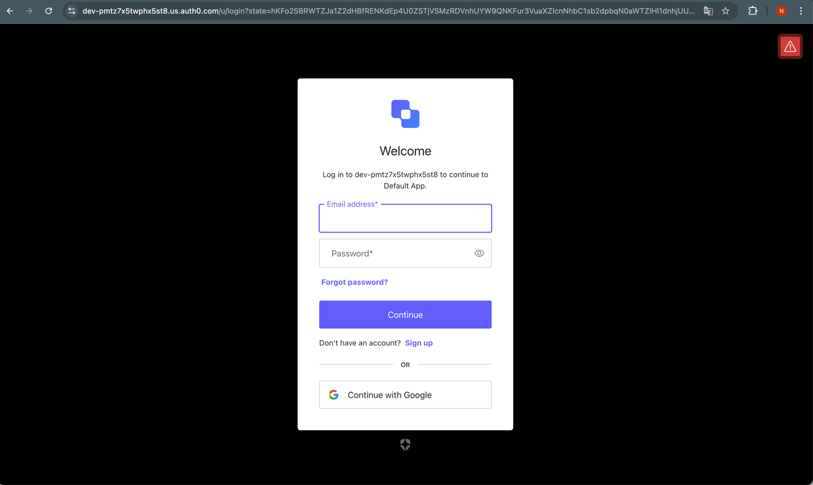
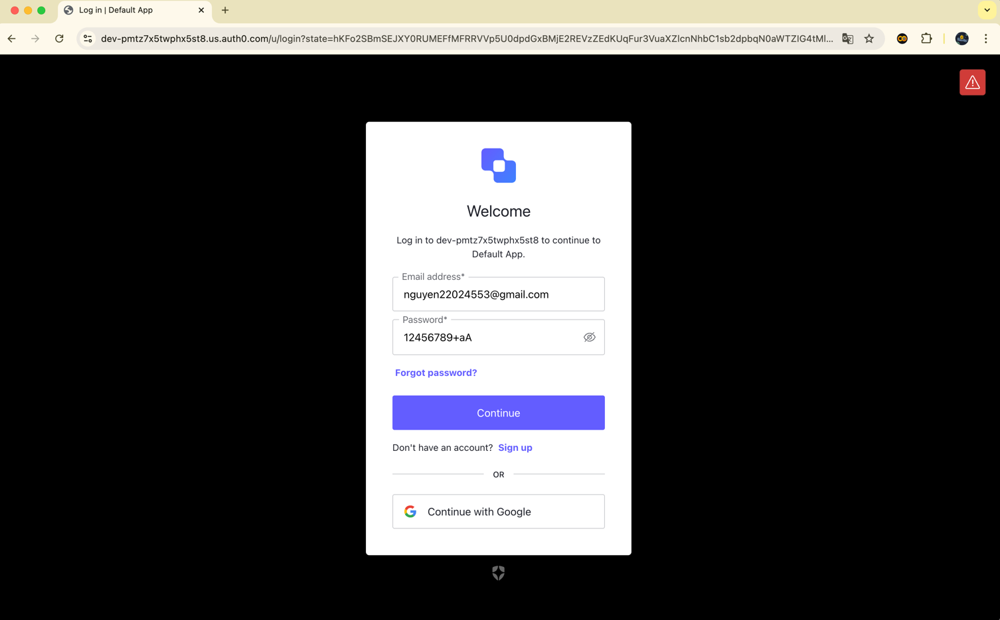
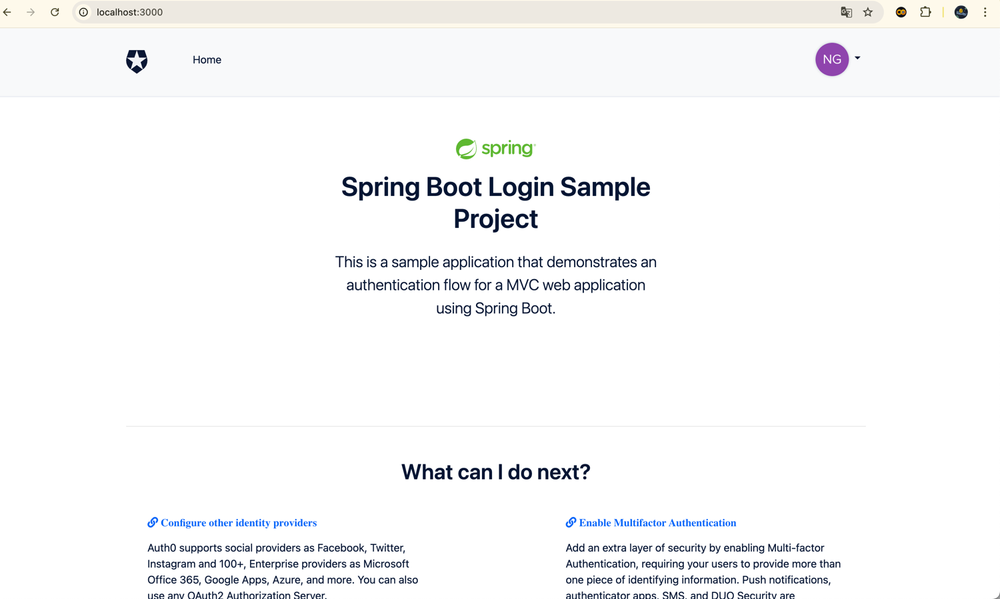
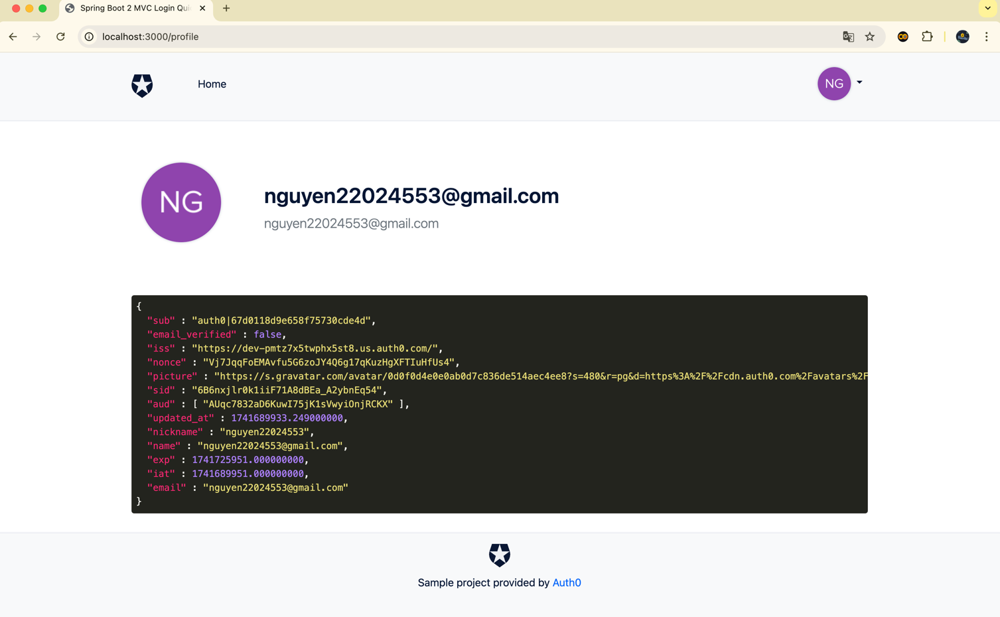

#### Họ và tên: Nguyễn Trung Nguyên
#### Mã số sinh viên: 22024553

Dùng lệnh `./gradlew bootRun` để chạy chương trình
Sau đó truy cập vào  `http://localhost:3000/` để vào ứng dụng:

Chọn `LOGIN` để tiến hành đăng nhập:

Tại đây tiến hành đăng nhập bằng tài khoản `user` được thêm vào bằng tài khoản admin dùng cho AuthO trước đó

Đăng nhập thành công, thông tin của người dùng được hiển thị:

